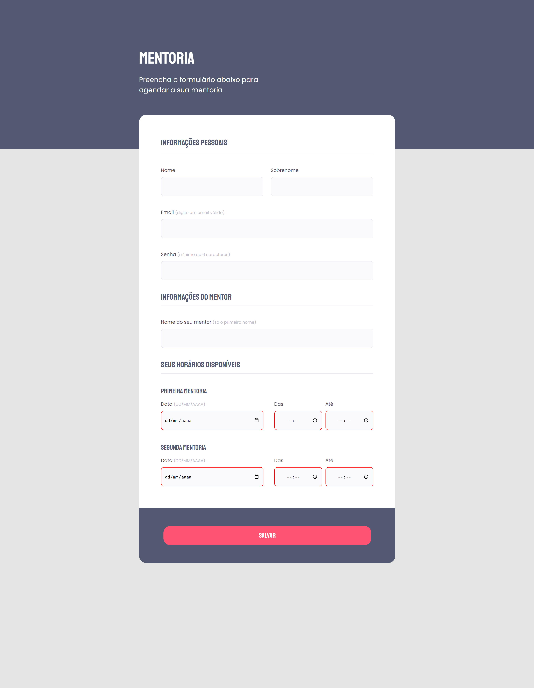

<h1 align="center">Formulário de agendamento de Mentoria</h1>

## 📋 Descrição do projeto

O <strong>formulário de mentoria</strong> é um projeto realizado como desafio da Trilha Explorer da <a href="https://www.rocketseat.com.br/" target="_blank">@Rocketseat</a> para a construção de formulários com <em>HTML</em> e <em>CSS</em>.

> HTML:
- Tags semânticas e de acessibilidade;
- Tags de texto;
- Tipos de inputs e seus respectivos atributos;
- Organização e agrupamento dos campos de entrada;
- Utilização de <em>divs</em> dentro dos <em>fieldsets</em> para evitar bugs com o <em>legend</em>;
- Validações.
 
> CSS:
- Box-sizing;
- Propriedades de posição e espaçamento dos elementos;
- Transformações de textos;
- Estilos de bordas;
- Modo de exibição dos elementos;
- Pseudo-classes;
- Criação de novos elementos <em>HTML</em> via <em>CSS</em>;
- Modelos de cursor.

> Protótipo:

🔗 [Clique aqui para acessar](https://nathxrz.github.io/TrilhaExplorer-forms02/)
 

## 🛠️ Tecnologias
- HTML
- CSS

## 📩 Contato
> 📧 nathyrezendemachado@gmail.com  
> 💼 <a href="https://www.linkedin.com/in/nathalia-machado-021b1b230/"> LinkedIn</a>  

    